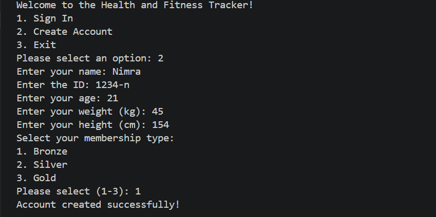
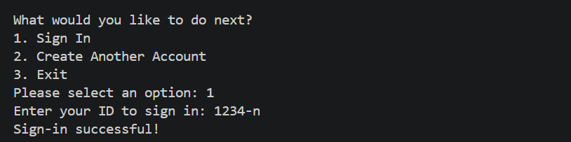
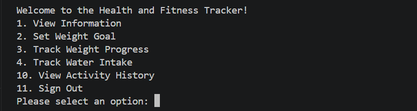

# Health & Fitness Tracker (C++)

A console-based Health and Fitness Tracker built using C++ that helps users monitor their fitness activities, goals, and daily habits.

---

## Features

- User account system (Sign up / Sign in)
- 🥉 Bronze, 🥈 Silver, 🥇 Gold membership levels
- Weight tracking and goal management
- Water intake tracking
- Blood pressure monitoring
- Sleep tracking
- Reminders system
- Activity history with timestamps

---

## Data Structures & Concepts Used

- Binary Search Tree (BST) → stores activity history (sorted by time)
- Stack → tracks activity actions
- Queue → manages reminders
- Map (STL) → stores user data
- Linked List → tracks weight logs
- Object-Oriented Programming (OOP)
  - Inheritance (Bronze → Silver → Gold)
  - Polymorphism
  - Encapsulation

---

## Technologies Used

- C++
- Standard Template Library (STL)

---

## Preview

### User Creation

### Sign-In

### Main Menu

---

## Learning Outcomes

This project helped me understand:
- Implementation of real-world systems using data structures
- OOP concepts like inheritance and polymorphism
- Managing dynamic data using STL
- Designing menu-driven applications

---

## 📌 Future Improvements

- File handling (save user data permanently)
- GUI version of the application
- Improved user interface
